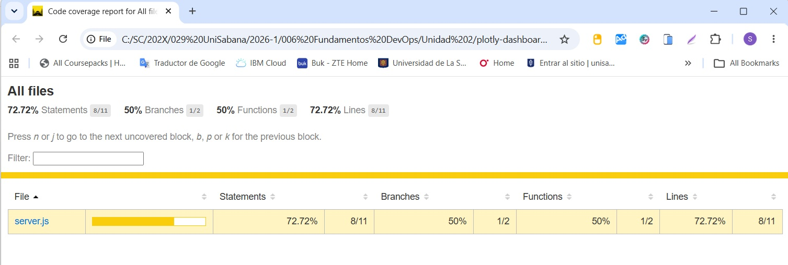
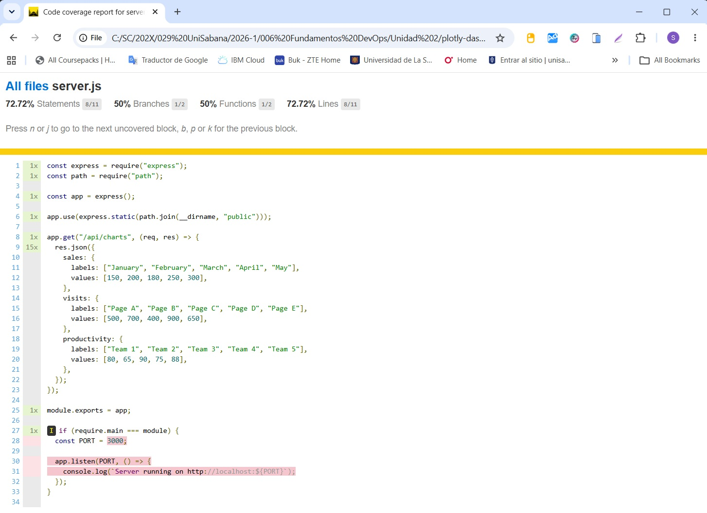
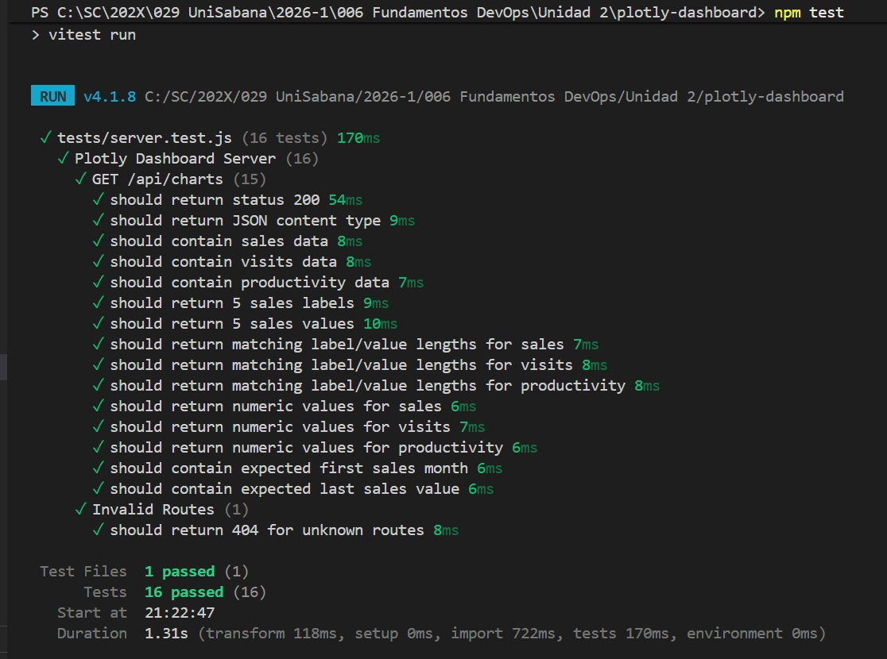
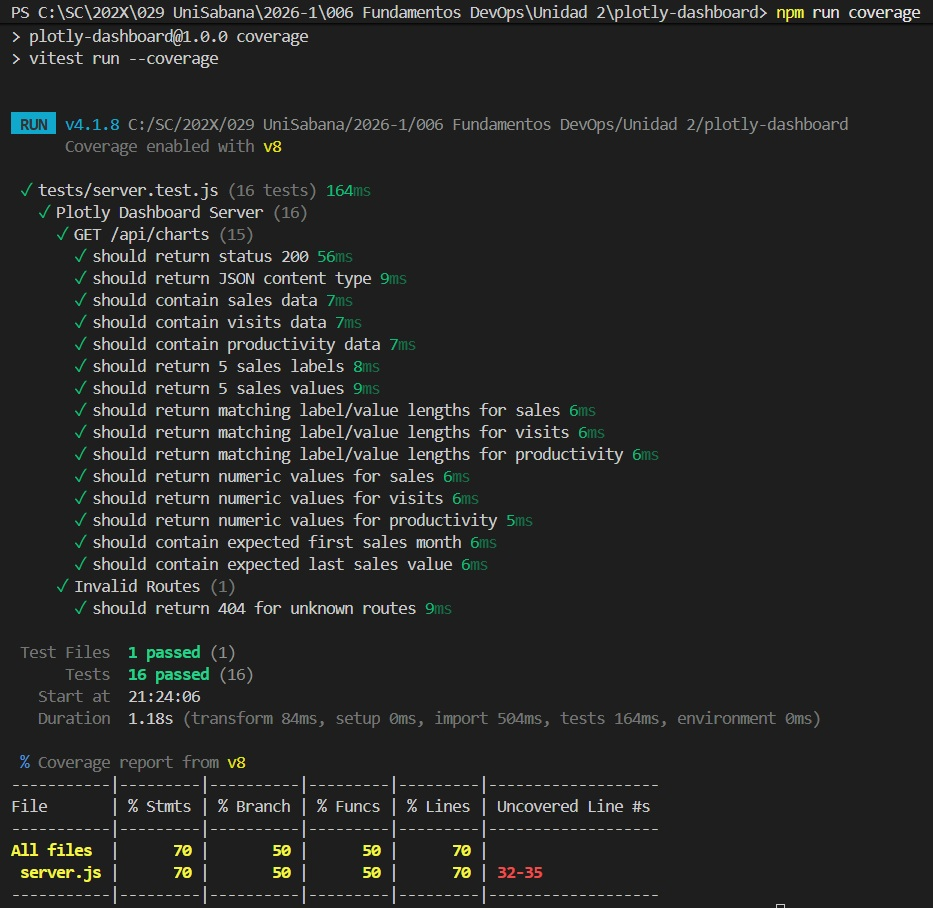
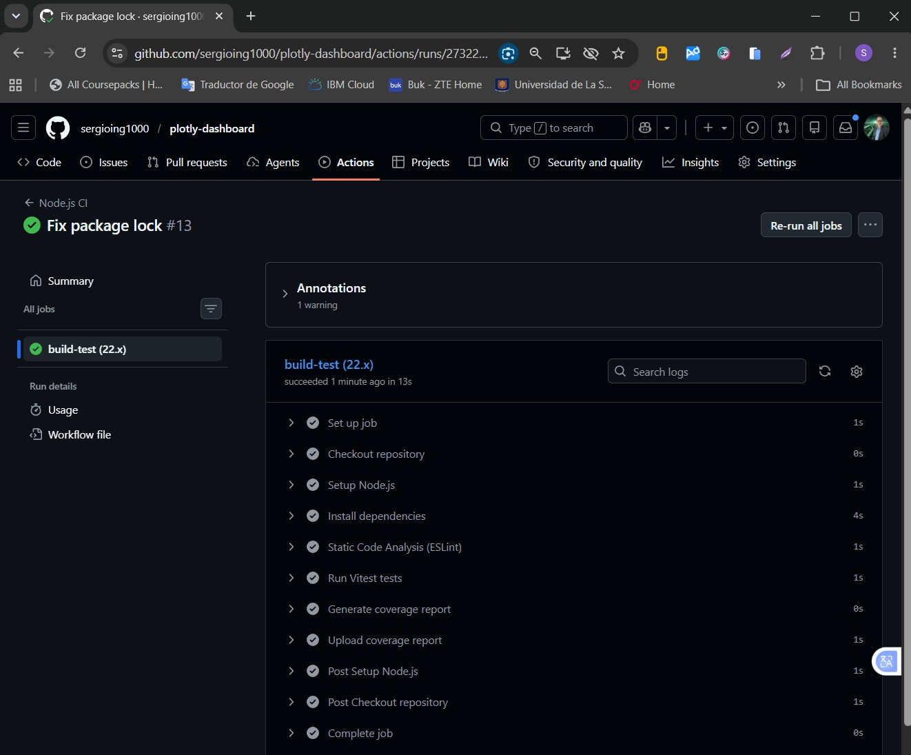
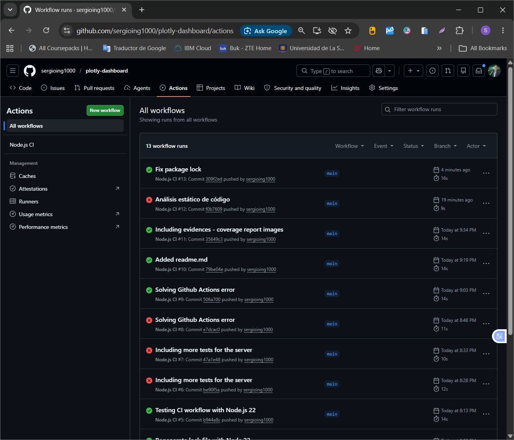

#  Pipeline CI con GitHub Actions


Este proyecto utiliza **GitHub Actions** para automatizar la integración continua (CI) mediante la ejecución automática de pruebas unitarias y generación de reportes de cobertura cada vez que se realizan cambios en el código fuente.

## 📋 Objetivo

Garantizar que cada cambio enviado al repositorio sea validado automáticamente mediante:

* Instalación de dependencias.
* Ejecución de pruebas unitarias con **Vitest**.
* Generación de reportes de cobertura de código.
* Almacenamiento del reporte de cobertura como artefacto descargable.

Se garantiza que se logra \
✅ Integración Continua (CI) \
✅ Análisis estático de código (ESLint) \
✅ Pruebas unitarias automatizadas (Vitest) \
✅ Medición de cobertura de código \
✅ Publicación de artefactos de cobertura \

---

## ⚙️ Archivo de configuración

La automatización está definida en:

```text
.github/workflows/ci.yml
```

---

## 🔄 Eventos que activan el pipeline

El flujo se ejecuta automáticamente cuando ocurre alguno de los siguientes eventos:

### Push

Cuando se realiza un commit y se envía a las ramas:

```yaml
push:
  branches:
    - main
    - develop
```

### Pull Request

Cuando se crea o actualiza un Pull Request hacia:

```yaml
pull_request:
  branches:
    - main
    - develop
```

Esto permite validar los cambios antes de que sean fusionados.

---

## 🏗️ Job principal

El workflow define un único trabajo llamado:

```yaml
build-test
```

que se ejecuta sobre una máquina virtual Linux:

```yaml
runs-on: ubuntu-latest
```

---

## 🔧 Pasos del Pipeline

### 1. Clonar el repositorio

```yaml
- name: Checkout repository
  uses: actions/checkout@v4
```

Descarga el código fuente del repositorio dentro del entorno de ejecución de GitHub Actions.

---

### 2. Configurar Node.js

```yaml
- name: Setup Node.js
  uses: actions/setup-node@v4
```

Configura el entorno de Node.js utilizando la versión:

```yaml
22.x
```

Además, habilita el caché de dependencias npm para acelerar futuras ejecuciones:

```yaml
cache: npm
```

---

### 3. Instalar dependencias

```yaml
- name: Install dependencies
  run: npm ci
```

Instala todas las dependencias definidas en:

* package.json
* package-lock.json

El comando `npm ci` es recomendado para entornos CI porque garantiza instalaciones reproducibles y más rápidas.

---

### 4. Ejecutar pruebas unitarias

```yaml
- name: Run Vitest tests
  run: npm test
```

Ejecuta todas las pruebas unitarias configuradas con **Vitest**.

Si alguna prueba falla:

* El workflow se detiene.
* El job es marcado como fallido.
* El Pull Request no debería ser aprobado hasta corregir los errores.

---

### 5. Generar reporte de cobertura

```yaml
- name: Generate coverage report
  run: npm run coverage
```

Genera métricas de cobertura de código que permiten conocer qué porcentaje del proyecto está siendo validado por las pruebas automatizadas.

Los resultados se almacenan en el directorio:

```text
coverage/
```

---

### 6. Publicar reporte de cobertura

```yaml
- name: Upload coverage report
  uses: actions/upload-artifact@v4
```

Sube el contenido del directorio:

```yaml
path: coverage/
```

como un artefacto llamado:

```yaml
name: coverage-report
```

Este artefacto puede descargarse desde la ejecución del workflow en GitHub para revisar los resultados detallados de cobertura.

---

## 📈 Flujo de ejecución

```text

Push / Pull Request
        │
        ▼
 Checkout Repository
        │
        ▼
 Setup Node.js 22.x
        │
        ▼
 npm ci
        │
        ▼
 ESLint (Análisis estático) - ADICIONAL
        │
        ▼
 Vitest (Pruebas unitarias)
        │
        ▼
 Coverage Report
        │
        ▼
 Upload Artifact


```

---

## ✅ Beneficios

* Validación automática del código.
* Detección temprana de errores.
* Ejecución consistente en todos los entornos.
* Generación automática de métricas de calidad.
* Soporte para integración continua (CI).
* Mayor confianza antes de realizar merges a `main` o `develop`.

---

## 🛠️ Tecnologías utilizadas

* Node.js 22.x
* npm
* Vitest
* GitHub Actions

---

## 📂 Ubicación del Workflow

```text
.github/
└── workflows/
    └── ci.yml
```

Este archivo es el responsable de ejecutar automáticamente todo el proceso de integración continua del proyecto.

## 📋 Evidencias de ejecución

### 📷Coverage All Files


### 📷Coverage server.js


### 📷npm run test


### 📷npm run coverage


### 📷Github Actions

### 📷Github Actions All workflows


____________________________________________________________________________

#  Pipeline CD con Jenkins

```text
┌─────────────────────┐
│ Push a GitHub       │
└──────────┬──────────┘
           │
           ▼
┌─────────────────────┐
│ Jenkins Trigger     │
└──────────┬──────────┘
           │
           ▼
┌─────────────────────┐
│ Clonar repositorio  │
└──────────┬──────────┘
           │
           ▼
┌─────────────────────┐
│ docker build        │
└──────────┬──────────┘
           │
           ▼
┌─────────────────────┐
│ Login Docker Hub    │
└──────────┬──────────┘
           │
           ▼
┌─────────────────────┐
│ docker push         │
└──────────┬──────────┘
           │
           ▼
┌─────────────────────┐
│  Imagen disponible  │
│   en Docker Hub     │
└─────────────────────┘
```

## Jenkinsfile 


```text
pipeline {
    agent any

    environment {
        REPO_URL = 'https://github.com/usuario/plotly-dashboard.git'
        IMAGE_NAME = 'usuarioDockerHub/plotly-dashboard'
        IMAGE_TAG = "${BUILD_NUMBER}"
    }

    stages {

        stage('Clonar Repositorio') {
            steps {
                git branch: 'main', url: REPO_URL
            }
        }

        stage('Construir Imagen Docker') {
            steps {
                sh "docker build -t ${IMAGE_NAME}:${IMAGE_TAG} ."
            }
        }

        stage('Login Docker Hub') {
            steps {
                withCredentials([
                    usernamePassword(
                        credentialsId: 'dockerhub-creds',
                        usernameVariable: 'DOCKER_USER',
                        passwordVariable: 'DOCKER_PASS'
                    )
                ]) {

                    sh """
                    echo \$DOCKER_PASS | docker login \
                    -u \$DOCKER_USER --password-stdin
                    """
                }
            }
        }

        stage('Publicar Imagen') {
            steps {
                sh "docker push ${IMAGE_NAME}:${IMAGE_TAG}"

                sh """
                docker tag ${IMAGE_NAME}:${IMAGE_TAG} \
                ${IMAGE_NAME}:latest
                """

                sh "docker push ${IMAGE_NAME}:latest"
            }
        }
    }
}
```

### Explicación de cada instrucción


| Instrucción | Descripción | 
| --- | --- |
| FROM node:22-alpine | Utiliza una imagen ligera de Node.js 22. |
| WORKDIR /app | Define el directorio de trabajo dentro del contenedor. |
| COPY package*.json ./ | Copia package.json y package-lock.json. |
| RUN npm install	 | Instala las dependencias del proyecto. |
| COPY . .	 | Copia el resto de archivos de la aplicación. |
| EXPOSE 3000		 | Documenta que la aplicación escucha en el puerto 3000. |
| CMD ["node", "server.js"]		 | Inicia la aplicación Express. |

## dockerfile 

Docker version 29.2.1, build a5c7197

```
# Imagen base oficial de Node.js
FROM node:22-alpine

# Directorio de trabajo dentro del contenedor
WORKDIR /app

# Copiar archivos de dependencias
COPY package*.json ./

# Instalar dependencias
RUN npm install

# Copiar el resto de la aplicación
COPY . .

# Puerto que utiliza la aplicación
EXPOSE 3000

# Comando para iniciar la aplicación
CMD ["node", "server.js"]
```
